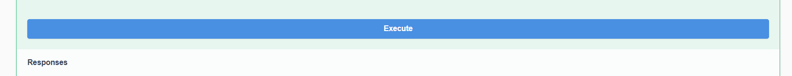

# Project README

## Overview

This project is designed to handle employee data and Covid details. It consists of multiple layers, including the DAL (Data Access Layer), BL (Business Logic Layer), and MyService layer.

## MyService Layer
The MyService layer serves as the API layer for interacting with the application. It contains controllers that handle incoming HTTP requests and delegate processing to the BL layer. Controllers return appropriate HTTP responses with data or error messages.

### Files:
- **CovidDtailesController.cs**: Controller for handling Covid detail-related endpoints.
- **EmployeeController.cs**: Controller for handling employee-related endpoints.

## BL (Business Logic Layer)
The BL layer contains the business logic of the application. It orchestrates data manipulation and validation, calling appropriate methods from the DAL layer. It also contains mapping logic using AutoMapper for mapping between DTOs (Data Transfer Objects) and entities.

### Files:
- **CovidDetailesBl.cs**: Implements the `ICovidDatailesBl` interface for Covid detail-related business logic.
- **EmployeeBl.cs**: Implements the `IEmployeeBl` interface for employee-related business logic.

## DAL (Data Access Layer)
The DAL is responsible for interacting with the database and performing CRUD operations. It contains implementations for various data access interfaces, such as `IEmployeeDal`, `ICovidDetailDal`, etc. Each DAL implementation interacts with the database context (`DB_Context`) using Entity Framework Core.

### Files:
- **CityServiceDal.cs**: Implements the `ICityDal` interface for city-related operations.
- **CovidDetailServiceDal.cs**: Implements the `ICovidDetailDal` interface for Covid detail-related operations.
- **EmployeeServiceDal.cs**: Implements the `IEmployeeDal` interface for employee-related operations.
- **VaccineManufacturerServiceDal.cs**: Implements the `IVaccineManufacturerDal` interface for vaccine manufacturer-related operations.
- **StreetServiceDal.cs**: Implements the `IStreetDal` interface for street-related operations.
- **AddressServiceDal.cs**: Implements the `IAddressDal` interface for address-related operations.

## How to Run the Project
first- open the 'corona_Hub_exe.sln' file at the 'corona_Hub_Exe' dir:

in the browse choose the db file from your local computer.
1.connect to the db file in the data connection in the server explorer tool.

2. Set up the database connection string:
      -go to file:'ServiceCollectionExtensions.cs'
      -at line :            string connString = "...here" replace the connString to your connection string of your db connection.
      - go to file:'DB_Context.cs' in models dir in dal layer 
      -at func: 'public OnConfiguring' 
      -change th connstring:at optionsBuilder.UseSqlServer(...here)

3. Run the database migrations to create the database schema.

4. Start the application and make HTTP requests to the defined endpoints.
when you run up the project there will be a swgger up with a locallhost 5073(http://localhost:5073/swagger/index.html):

and then you can choose to create an employee or just to create employee_covid_detailes to a specific Numberid_employee.
1. create amployee:

and then enter the 'try it out' button:
and then enter all the parameters:

and then run the execute button:
and there will be a 200 status code of succes:

2. gat by id_employee or by number_id_employee:
i choose by number_id_employee:
and then i got the information:

